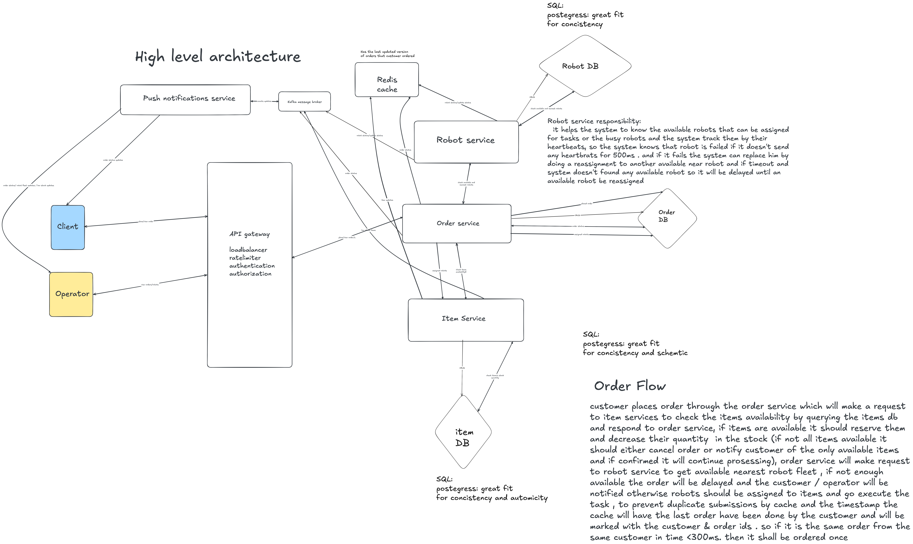

# CodeRefine Qualification 2 - Carieeer

## [Excalidraw file](amazieee.excalidraw)

## Functional Requirements :

- system should receive and validate orders (same order shouldn't get processed twice)
-  system should check availability of order's items 
- system should reserve order items to prevent overselling
- system should allocate robots to pack order
- system should get progress of robots handling the order continuously
- system should move order to packing station after fully collecting the order
- warehouse operators should view order status (Received → Confirmed →etc..)
- system should notify operators about important events (low stock, a robot failure, a delayed      order, or a robot with a low battery)
- customer should place and track (get notified) order status 

## nonFunctional Requirements :

- scalability to handle many orders
- resilience to handle robot failures
- consistency to prevent overselling items
- idempocity (I dont remember the exact word but it is for handling order submitted twice or more)

## Data Model :

```text
Customer 
{
    - id
    - name
    - Order[]
    - address
    - email
    - password
    - payment_info

}
```
``` text
Operator
{
    - id
    - name
    - email
    - password
    - Item[]

}
```
```text
Order
{
    - id(PK)
    - items[<item_id(fk) : quantity>]
    - ordered_at:Time
    - status <Received ,Confirmed , Picking , Collected , Packed , Ready for Shipping, or Cancelled / Failed>
    - robot_fleet_status
    - customer_id
    - estimated_arrival_time

}
```


```text
Item
{
    - id(pk)
    - stock_quantity
    - price
    - name
    - is_available

}
```

```text
Robot
{
    - id(pk)
    - status <ASSIGNED,INPROGRESS,COMPLETED,FAILED>
    - item_id(fk)
    - location <x,y>
    - battery level
}
```

## API Design

**`POST orders/place -> Result<200ok<Partial<Order<Received>>>,Error>`**

```text
{
    - items[<item_id(fk) : quantity>]
    - ordered_at:Time
    - customer_id
}
```

**`GET /orders/order?page{}-> Result<200ok<Order[]>,Error>`**

**`GET /orders/ordrer?{id}-> Result<200ok<Order<id>>>,Error>`**

**`GET /orders/status/order?{id} -> Result<200ok<Partial<Order<status>>>,Error>`**

**`PUT /orders/update_status/order?{id} -> Partial<Order<status>>`**

```text
{
    - new_order_status
}
```

**`GET /items/isavailable/item?{id} -> Result<200ok<True,False>,Error>`**

**`PUT /items/reserve/item -> Result<200ok<Item>,Error>`**
```text
{
    - item_id
    - item_quantity
}
```

**`POST /robots/allocate -> Result<200ok<<Robots[],Order>>,Error>`**
```text
{
    - order_id
}
```

**`GET /robots/status/robot?{id} -> Result<200ok<Partial<Robot<status>>>,Error>`**

**`Event-Listener ("low stock") -> item stock is low notify operator`**

```text
{
    - item_id
}
```
**`Event-Listener ("low battery robot") -> robot battery is low notify operator`**
```text
{
    - robot_id
}
```

**`Event-Listener ("failed robot") -> robot failed notify operator`**
```text
{
    - robot_id,
    - order_id<delayed by robot failure (<5s)>
}
```


**`Event-Listener ("ORDER_STATUS") -> order status changed notify customer`**
``` text
{
    - order_id,
    - customer_id,
}
```

## High level architecture :


----
## Deep Dives :
- Designing system like this actually the first thing we
  should think about is scalability as the system can scale
  to handle more users, orders and robots and so on

- How the system shall solve problems like robot failure?
  here the answer is resilience which help the system to be 
  more effecient as even if the robot failed the customer's
  order doesn't get affected and the order arrives to the 
  customer in the estimated time. and we can achieve this
  when the robot fails it will notify the system. then the 
  system will search for the nearest available robot to take 
  his place. if there is no robots so we will delay the order
  and notify the customer that it will be delayed for a little
  time.

- How the system can handle the oversalling problem?
  here the role of consistency comes , so the last updated
  version of the system shall be obvious to the customer immediately

- How the system handle two orders can never claim the same last unit?
  here we can use a queue which can enhance the process , so we can see
  who the first one who ordered the last item and then we can assign it
  to it so no one else can order it.

- How the system handling that the customer order to be requested once?
  the point here is handled by cache abd the timestamp the cache will have
  the last order have been done by the customer and will be marked with the
  customer & order id . so if it is the same order from the same customer in
  time <300ms. then it shall be ordered once.
---
## Team Members :
### Fatma Omara
### Salma Shaker


